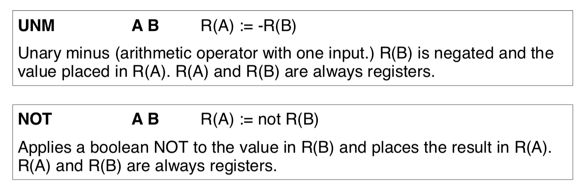
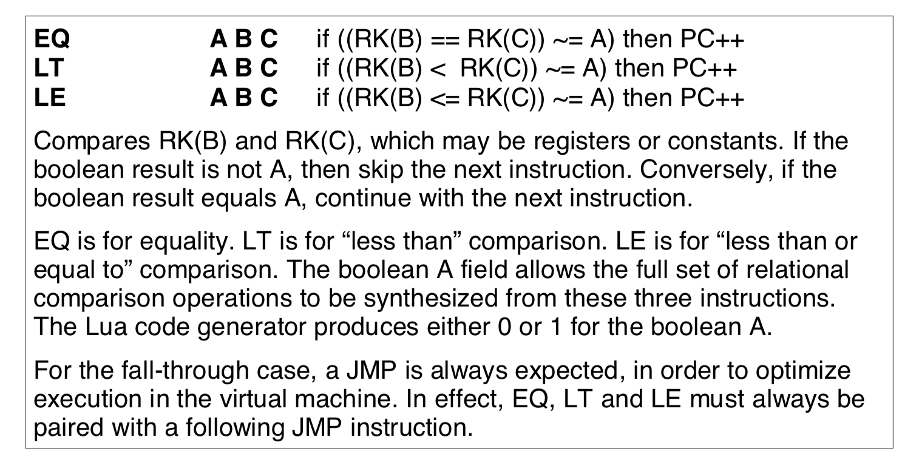
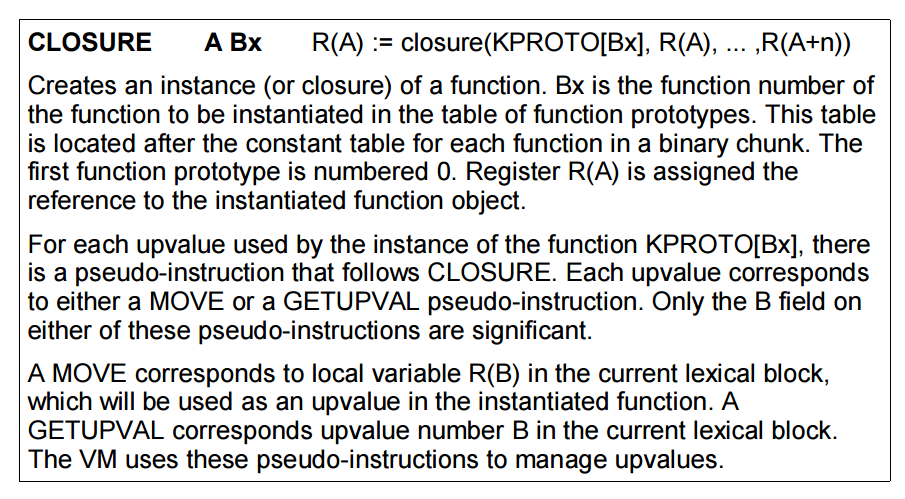

# A No-Frills Introduction to Lua 5.1 VM Instructions

## 目录

*   [1. Introduction](#1-introduction)

*   [2. Lua Instruction Basics](#2-lua-instruction-basics)

*   [3. Really Simple Chunks](#3-really-simple-chunks)

*   [4. Lua Binary Chunks](#4-lua-binary-chunks)

    *   [4.1 Header parts](#41-header-parts)

    *   [4.2 Top-level function parts](#42-top-level-function-parts)

*   [5. Instruction Notation](#5-instruction-notation)

*   [6. Loading Constants](#6-loading-constants)

*   [7. Upvalues and Globals](#7-upvalues-and-globals)

*   [8. Table Instructions](#8-table-instructions)

*   [9. Arithmetic and String Instructions](#9-arithmetic-and-string-instructions)

*   [10. Jumps and Calls](#10-jumps-and-calls)

*   [11. Relational and Logic Instructions](#11-relational-and-logic-instructions)

*   [12. Loop Instructions](#12-loop-instructions)

*   [13. Table Creation](#13-table-creation)

*   [14. Closures and Closing](#14-closures-and-closing)

*   [15. Comparing Lua 5.0.2 and Lua 5.1](#15-comparing-lua-502-and-lua-51)

*   [16. Digging Deeper](#16-digging-deeper)

## 1. Introduction

> This is a no-frills introduction to the instruction set of **Lua 5.1**

Use **ChunkSpy** as a disassembler.

## 2. Lua Instruction Basics

Lua instructions have a fixed size, using a 32-bit unsigned integer data type by default. They are totally **38 opcodes** with 3 types as enumerated as **iABC, iABx, iAsBx** as following:


Fields A, B and C usually refers to register numbers.

All opcodes in Lua 5.1 as below:

1.  **MOVE**→ Copy a value between registers

2.  **LOADK**→ Load a constant into a register

3.  **LOADBOOL**→ Load a boolean into a register

4.  **LOADNIL**→ Load nil values into a range of register (emm. why ranges?)

5.  **GETUPVAL**→ Read an upvalue into a register

6.  **GETGLOBAL**→ Read a global variable into a register

7.  **GETTABLE**→ Read a table element into a register

8.  **SETGLOBAL**→ Write a register value into a global variable

9.  **SETUPVAL**→ Write a register value into an upvalue

10. **SETTABLE**→ Write a register value into a tabel element

11. **NEWTABLE**→ Create a new table

12. **SELF**→ Prepare an object method for calling

13. **ADD**→ Addition operator

14. **SUB**→ Subtraction operator

15. **MUL**→ Multiplication operator

16. **DIV**→ Division operator

17. **MOD**→ Modulus (remainder) operator

18. **POW**→ Exponentiation operator

19. **ENM**→ Unary minus operator

20. **NOT**→ Logical NOT operator

21. **LEN**→ Length operator

22. **CONCAT**→ Concatenate a range of registers

23. **JMP**→ Unconditional jump

24. **EQ**→ Equality test

25. **LT**→ Less than test

26. **LE**→ Less than or equal to test

27. **TEST**→ Boolean test, with conditional jump

28. **TESTSET**→ Boolean test, with conditional jump and assignment

29. **CALL**→ Call a closure

30. **TAILCALL**→ Perform a tail call

31. **RETURN**→ Return from function call

32. **FORLOOP**→ Iterate a numeric for loop

33. **FORPERP**→ Initialization for a numeric for loop

34. **TFORLOOP**→ Iterate a generic for loop

35. **SETLIST**→ Set a range of array elements for a table

36. **CLOSE**→ Close a range of locals being used as upvalues

37. **CLOSURE**→ Create a closure of a function prototype

38. **VARARG**→ Assign vararg function arguments to registers

PS: **Opcode = Index - 1**, so opcode 0 → MOVE

## 3. Really Simple Chunks

This chapter shows some examples about how ChunkSpy helps to disassasmble lua code.

We ignore the details, only lists some features of ChunkSpy:

*   Comment lines are prefiexed by a semicolon;

*   Data or header information that isn't an instruction is shown as an assambler directive with a dot prefix;

*   luac-style comments are generated for some instructions.

## 4. Lua Binary Chunks

Lua can dump functions as **binary chunks**, which can then be written to a file, loaded and run.

A binary chunk consist of two parts: a header block and a top-level function.

### 4.1 Header parts

A Lua 5.1 binary chunk header is always 12 bytes in size, shownd as follow:


The header signature is for matching.

### 4.2 Top-level function parts


A **function block** in a binary chunk defines the prototype of a function. A function in a binary chunk consist of a few header elements and a bunch of lists. Debug data can be stripped.

Let's scrutinize each definitions:

*   **source name** : usually the name of the source file from which the binary chunk is  compiled (specified only for top-level function, otherwise empty);

*   **line difined** : \[self-explanatory]

*   **last line defined** : \[self-explanatory]

*   **number of upvalues** : \[self-explanatory]

*   **number of parameters** : \[self-explanatory]

*   **maximum stack size** : \[self-explanatory]

*   **is\_vararg**: comprise 3 bitfields

    *   **VARARG\_HASARG**: set if LUA\_COMPAT\_VARARG is defined

    *   **VARARG\_ISVARARG**: always set for a vararg function

    *   **VARARG\_NEEDSARG**: set if ... is not used within the function

After these definitions, the belows are all **List**.
The first list is the **instruction list**, or the actual code to the function.


Next is the\*\* list of constants\*\*:


The **function prototype list** comes after the constant list:


Function prototypes or function blocks have the exact same format as the top-level function or chunk.&#x20;

The lists following the list of prototypes is optional. They contain **debug information** and can be stripped to save space. First comes the **source line position list**:


Next is the **local lists**:


The final list is the **upvalue list**:


All the lists are not shared or re-used: Locals, upvalues, constants and prototypes referenced in the code must be specified in the respective lists in the same function.&#x20;

PS: The author also gives a simple example by using ChunkSpy to disassemble a simpel lua code. We don't discuss the detail here.

## 5. Instruction Notation

Some basic instruction notations:


About **PC** (Program Counter), it always points to the next instruction. So to skip a single instruction following the current instruction, add 1 to the PC. A displacement of -1 will theoretically cause a JMP instruction to jump back onto itself, causing an infinite loop.

## 6. Loading Constants

Loads and moves are the starting point of pretty much all processor or virtual machine instruction sets.


## 7. Upvalues and Globals


PS: The names of the global variables used by the funciton will be part of the constant list of the function.

PS 2: **GETGLOBAL** and **SETGLOBAL** needs a register operand, so for constant case like (a = 40), we need a **LOADK** instruction before to load that constant into the register.


## 8. Table Instructions


PS: For **RK** (Maybe register or constant), a constant is specified by setting the **MSB** of the operand, while a register is specified by setting the **MSB (Most Significant Bit)** to 0.

Allowing constants to be used directly reduces considerably the need for temporary registers (and avoid MOVE).&#x20;

## 9. Arithmetic and String Instructions


PS: As of Lua 5.1, the parser and code generator can perform limited constant expression folding or evaluation (only works for binary arithmetic operators and the unary minus operator).

In order to make full use of constant folding in Lua 5.1, the user just need to remember the usual order of evaluation of an expression’s elements and apply parentheses where necessary.

```lua
local a = a + 4 + 7 -- no optimization
local b = b + (4 + 7) -- with optimization, equal to b + 11
```

Next are instructions for performing unary minus and logical **NOT**:



Next is the **LEN** instructions:


Next is the **CONCAT** instructions:


Like **LOADNIL**, **CONCAT** accepts a range of registers.

## 10. Jumps and Calls

Lua does not have any unconditional jump feature in the language itself, but in the virtual machine, the unconditional jump is used in control structures and logical expressions.


Next we look at the CALL instruction, for calling instantiated functioins:


Complementing **CALL** is **RETURN**:


A TAILCALL is used only for one specific **return**style → return foo(bar). A tail call is effectively a goto, and avoids nesting calls another level deeper.&#x20;


The other instructions covered in this session is **SELF**and **VARARG**.


**SELF**is used for object-oriented programming.


A SELF instruction saves an extra instruction, and speed up the calling of methods in object-oriented programming.

```lua
foo:bar("baz") -- 1 GETGLOBAL for looking up "foo"
foo.bar(foo, "baz") -- 2 GETGLOBAL for looking up "foo
```

## 11. Relational and Logic Instructions

Relational and logic instructions are used in conjuction with some instructions to implement control structures or expression.



PS: For **IF** statements, the true block comes first followed by the false block in code generated by the conde generator.

Next are the two instructions used for performing boolean tests and implement Lua's logic operators:


For Lua's ternary operator, a TEST is used for **and**while a TESTSET is used for **or**.

## 12. Loop Instructions

Lua has dedicated instructions to implement the two types of **for** loops, while the other type of loops uses traditional test-and-jump.


These two instructions should be used together for a **numeric** loop logic.

**FORPREP** performs a negative step and jumps unconditionally to **FORLOOP** so that **FORLOOP** is able to correctly make the first loop test.

Apart from a numeric for loop, Lua has a **generic** for loop, implemented by **TFORLOOP**.


**repeat** and **while** loops use a standard test-and-jump structure.

For **while** loop, the test is made first.

## 13. Table Creation

There are two instructions for table creation and initialization. One instruction create the table while the other instruction sets the array elements of a table.


For the initialization of hash part of a table, use **SETTABLE**.

## 14. Closures and Closing

The final two instructions of the Lua virtual machine are a little involved because of the handling of upvalues. The first is **CLOSURE**, for instantiating function prototypes:



**GETUPVALUE** is used to indicate that the upvalue  is one or more level lower down.

**MOVE** is used to indicated that the upvalue is in the same level as the **CLOSURE**instruction.

For both of these two pesudo-instructions, the B field is used to point either to the upvalue or local in question.

The last instruction to be covered in this guide, **CLOSE**, also deals with upvalues:


*   Explicit: **do end** blocks or loop blocks

*   Implicit: function return

## 15. Comparing Lua 5.0.2 and Lua 5.1

No important.

## 16. Digging Deeper

> A good way of studying how any instruction functions is to find where its opcode appears in the Lua sources.
